# AMS HAN Gateway

[](https://github.com/thorelvin/AMS-HAN-Gateway/actions/workflows/python-checks.yml)
[](https://github.com/thorelvin/AMS-HAN-Gateway/actions/workflows/firmware-build.yml)

A practical AMS/HAN smart-meter monitoring project built around an ESP32 gateway and a local Reflex dashboard.

This repository focuses on the gateway-side monitoring experience: live meter visibility, replay-driven troubleshooting, diagnostics, phase and voltage analysis, and Norwegian power-cost context in one local web application. The goal is to keep the embedded gateway workflow lightweight while letting the dashboard handle parsing, storage, visualization, event detection, and operator-facing analysis.

It is intended as a practical engineering project for understanding household import and export behavior, identifying costly load peaks, tracking power-quality hints, and testing HAN workflows without depending on live hardware for every iteration.

## Key features

- ESP-IDF firmware scaffold for ESP32-WROOM-32D with UART2 HAN capture, NVS-backed config, MQTT publishing, and Home Assistant discovery republish
- Auto-detects the gateway over serial and remembers the last working COM port
- `Live View` dashboard with current power direction, import/export bars, capacity-step estimate, and hour/day/week energy rollups
- Device and link status for gateway identity, firmware, Wi-Fi, MQTT, and last frame activity
- `Warnings` view for missing voltage channels, voltage sag, phase spread, power steps, and load sessions
- `Power Patterns` analysis with user-selectable `TN` or `IT` mains interpretation, imbalance focus, and worst-spread summaries
- Load Signatures that group recurring power changes into likely household-device patterns with representative watt size and duty-cycle hints
- `Usage Map` analysis with time-weighted hourly buckets, weekday pattern view, thresholded phase-switch counts, and switching-activity gradient
- Local snapshot history with daily buckets, top-hour tracking, heatmaps, and event-signature summaries
- Cost analysis with Norwegian price areas `NO1` to `NO5`, configurable grid rates, capacity estimation, and explicit spot-price fallback warnings
- Replay and demo workflow for offline development, debugging, and scenario validation
- Upload support for replay logs directly from the dashboard
- Gateway control actions for `GET_INFO`, `GET_STATUS`, Wi-Fi setup, MQTT setup, and discovery republish
- Light and dark theme support for the full dashboard

## Verified hardware setup

The hardware setup used in this repository has been verified in practice with the ESP32 gateway, HAN adapter, and the local Reflex dashboard workflow shown below.

### Hardware reference

ESP32 gateway, terminal shield, USB link, and HAN adapter wiring used in the current setup:


Example setup:

- Smart meter with HAN port enabled
- HAN / M-Bus interface adapter
- ESP32-WROOM-32D dev board with USB connection
- USB connection from ESP32 to PC
- Windows PC running the Reflex dashboard

## Wiring diagram summary

The hardware is connected as follows:

- **Smart meter HAN port**
  Use the HAN / RJ45 output from the meter.
  In this setup, the HAN / M-Bus pair is taken from **pin 1** and **pin 2**.
  Polarity does **not** matter for the HAN pair itself.

- **HAN / M-Bus to TTL adapter**
  Connect the two HAN wires from the smart meter to the adapter input.
  The adapter acts as the electrical interface between the meter HAN signal and the ESP32 UART side.

- **Adapter to ESP32**
  The firmware uses **UART2** on the ESP32 for HAN communication.
  **ESP32 GPIO16** is configured as **HAN RX**.
  **ESP32 GPIO17** is configured as **HAN TX**.
  Use a shared **GND** between the adapter and the ESP32.
  The exact adapter power pin depends on the adapter board variant, so verify the board markings and voltage requirement before connecting VCC.

- **ESP32 to PC**
  Connect the ESP32 to the PC over USB.
  The USB link provides the PC-side serial channel on **UART0**, which the dashboard uses for `GET_INFO`, `GET_STATUS`, `FRAME`, and `SNAP` traffic.

This matches the current firmware configuration in the repository, where the HAN UART is set to `2400` baud on `UART2`.

## Quick launch path

For a simpler local start path, the repository now includes:

```bash
python scripts/run_dashboard.py
```

That helper installs the Python requirements and starts the Reflex dashboard from the repository root.

## Dashboard screenshots

The screenshots below show the current April 2026 interface and the main operator views available in the dashboard. Most examples use dark mode, while the main `Live View` screenshot below shows the alternative light theme.

### Live View

Current power direction, thicker import/export bars, capacity-step estimate, gateway health, and hour/day/week energy rollups:

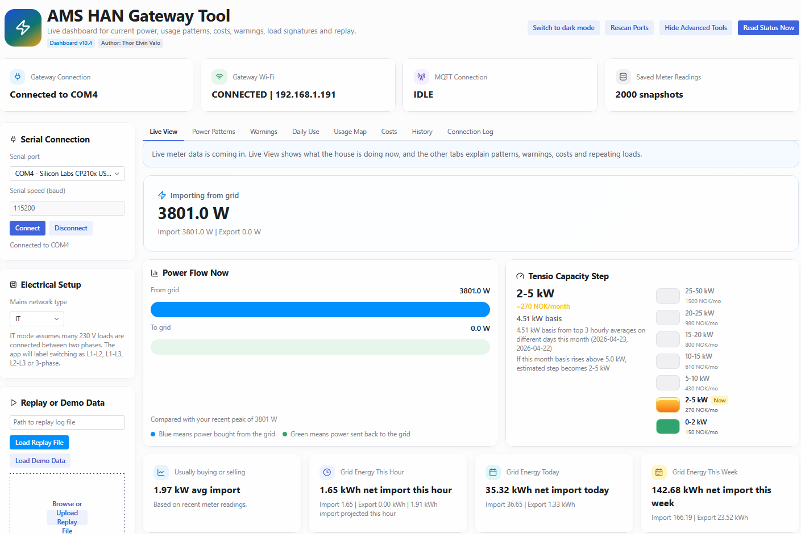

### Power Patterns

Phase and voltage summaries together with repeating-load detection, representative watt size, and duty-cycle hints:

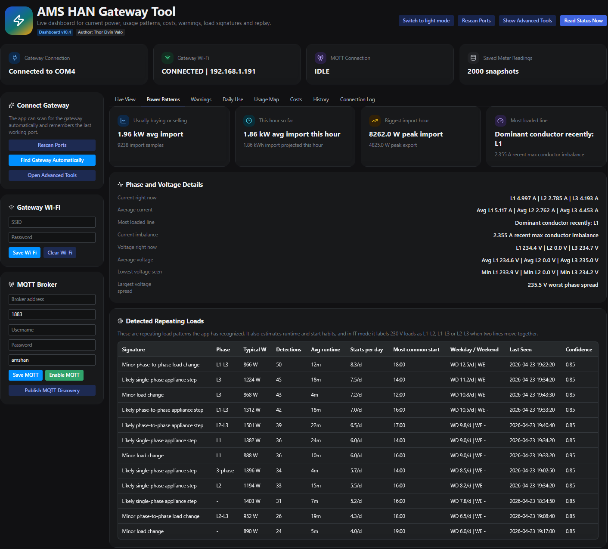

### Electrical setup and replay tools

The advanced sidebar contains manual serial controls, `TN` or `IT` mains selection, and the replay/demo workflow used for offline troubleshooting and fixture-driven testing:

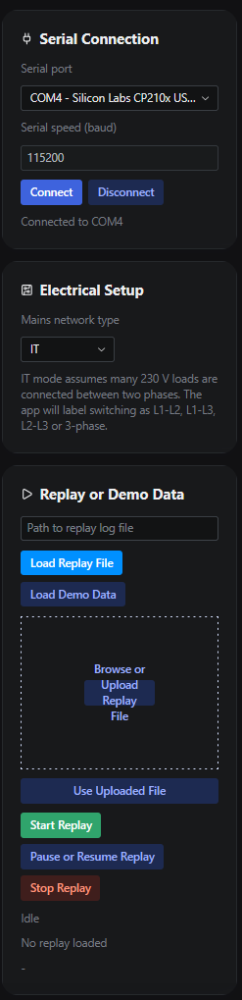

- **TN mode** treats most common 230 V appliance changes as `L1`, `L2`, or `L3` relative to neutral.
- **IT mode** treats many 230 V appliance changes as conductor-pair activity such as `L1-L2`, `L1-L3`, or `L2-L3`.
- The selected model affects event classification, detected repeating loads, heatmap switch counts, and wording in the phase-analysis summaries.

This matters because a Norwegian IT installation can otherwise make ordinary appliance steps look misleading if they are interpreted with a neutral-based TN model.

### Detected Repeating Loads explained

The `Detected Repeating Loads` table, still built around the same Load Signatures concept, is where the dashboard starts turning repeated power changes into practical operator hints instead of just raw meter values.

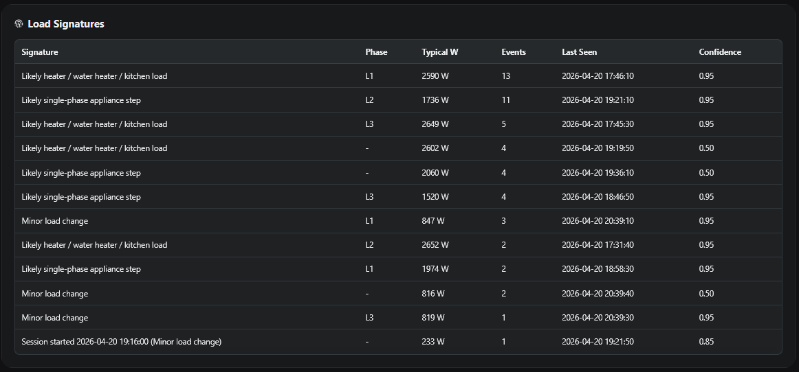

Each row represents a recurring pattern seen in the event engine:

- **Signature** is the dashboard's best current description of the load behavior, such as a likely heater step, a single-phase appliance step, or a smaller background change.
- **Phase** shows whether the pattern is mostly tied to `L1`, `L2`, `L3`, `L1-L2`, `L1-L3`, `L2-L3`, or is not yet phase-specific.
- **Typical W** gives the representative watt size of that signature, making it much easier to identify whether the change looks like a panel heater, water heater, kitchen appliance, EV-related load step, or a small background consumer.
- **Detections** shows how many times that pattern has been observed.
- **Avg Runtime** shows the average session length for signatures that produce clear start and end events.
- **Starts/Day** shows how often that signature begins across the observed history window.
- **Common Start** highlights the hour where that signature most often begins.
- **Weekday / Weekend** compares the per-day start frequency on weekdays versus weekends, which helps expose habits such as morning heating, weekend cooking, or evening EV charging.
- **Last Seen** helps confirm whether the device is currently active or was only present earlier in the session.
- **Confidence** shows how stable the classification is based on the samples collected so far.

Short step-like signatures may still show `-` for runtime if the data contains sharp power changes without a full load-session start/end pair.

Why this matters:

- It helps translate repeated import jumps into likely real household devices instead of forcing the user to interpret every power step manually.
- It makes troubleshooting faster when you are trying to find what caused a peak, phase imbalance, or a suspicious load session.
- It gives a practical bridge between raw HAN telemetry and energy optimization, because identifying a recurring `2500 W` to `2700 W` heater-like load is much more actionable than only seeing that import increased.
- It adds routine analysis, so recurring loads can be understood not just by size but also by timing, duty cycle, and weekday-versus-weekend behavior.
- It becomes more useful over time as the dashboard sees more repeated patterns in live traffic or replay logs.

### Warnings

Current warnings, connection health, and the filtered event timeline for power, voltage, phase, and data-quality events:

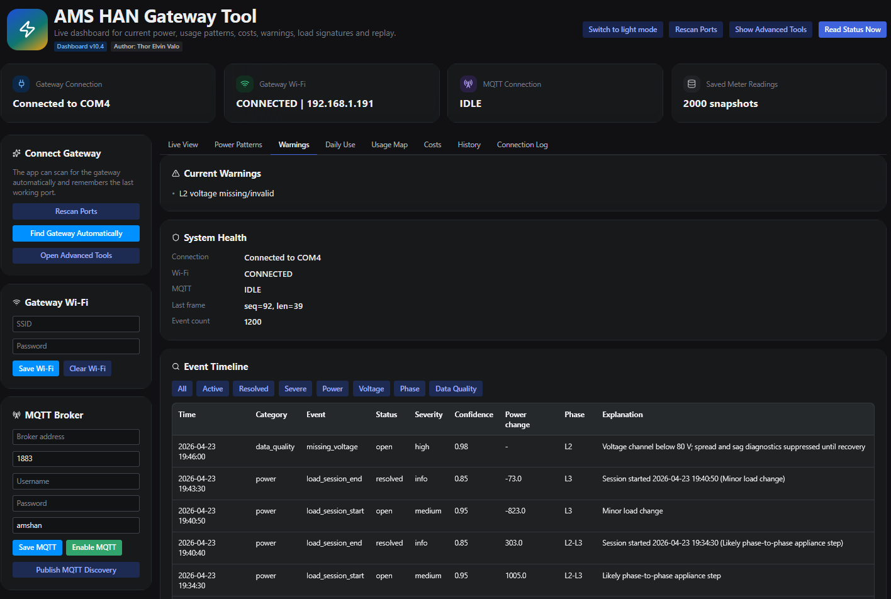

### Daily Use

Daily usage graph and hour-by-hour summary for the most recent day with data:

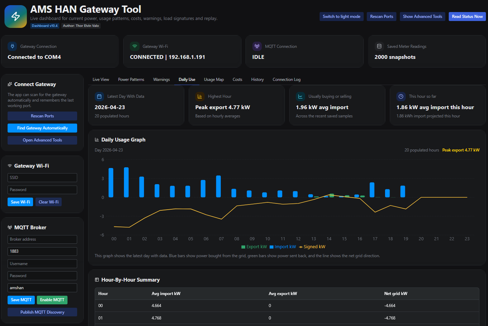

### Usage Map

The `Usage Map` tab turns stored history into a faster pattern-recognition view.

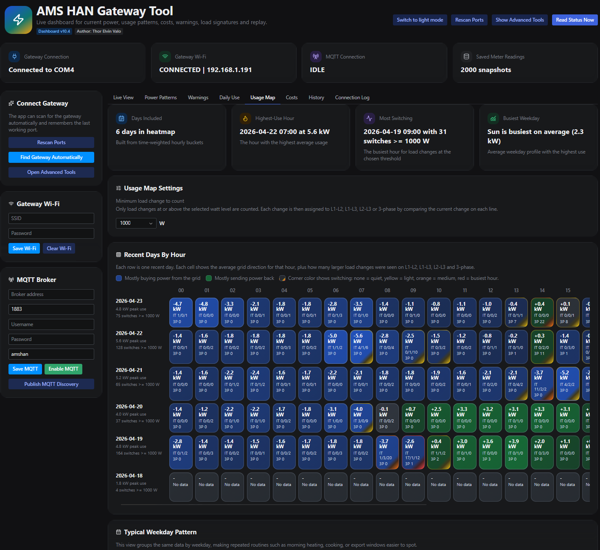

It contains two related views:

- **Recent Days By Hour**
  One row per recent day, one column per hour. This is meant for spotting where the house was steadily importing, steadily exporting, or repeatedly switching loads during specific hours.
- **Typical Weekday Pattern**
  The same hourly data collapsed into weekday rows. This makes repeated routines such as morning heating, daytime solar export, cooking peaks, EV charging windows, or night loads much easier to see.

How to read each usage-map cell:

- The large number such as `-2.1 kW` or `+3.3 kW` is the **average net load for that hour**.
  Negative means import-dominant.
  Positive means export-dominant.
- `L x/y/z` is the count of **load switches assigned to the active mains model** for that hour.
  In `TN` mode that means `L1/L2/L3`.
  In `IT` mode that means `L1-L2/L1-L3/L2-L3`.
- `3P n` is the count of **balanced 3-phase switch events** in that hour.
- The **blue/green background** shows whether the hour was import-heavy or export-heavy overall.
- The **corner accent** is hidden for quiet hours, then steps from **yellow** to **orange** to **red** as switching activity increases.

The `Minimum load change to count` dropdown controls which signed power changes are counted as switches. The default is `300 W`, but the user can raise or lower the threshold from `100 W` to `1500 W` depending on whether the goal is to catch small appliance changes or only larger load steps.

The screenshot above shows the usage-map summary cards, the switch-threshold selector, and both the recent-day and weekday-pattern views together in the current dashboard.

Why this matters:

- It makes recurring hourly routines much easier to see than a raw history table.
- It connects visible grid behavior to likely real switching activity on specific phases.
- It helps separate steady background load from hours with active device cycling or rapid appliance changes.
- It gives a practical bridge between phase analysis, Load Signatures, and cost/capacity planning.

### Costs

Price area, live cost estimate, explicit price-warning handling, electricity price settings, and hourly cost breakdown:

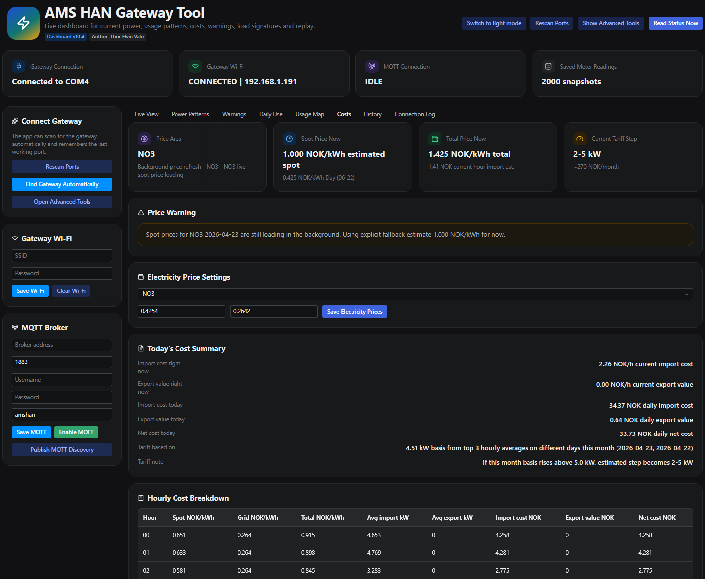

The cost view is designed to be practical and transparent rather than pretending to be a billing engine. Spot-price fallback is explicit in the UI, the day and night grid-energy values are user-adjustable in the `Costs` tab, and the monthly capacity-step ladder should be read as a built-in reference estimate unless you adapt the defaults to your local utility.

### History

Stored snapshot history with averages, peaks, and local database context:

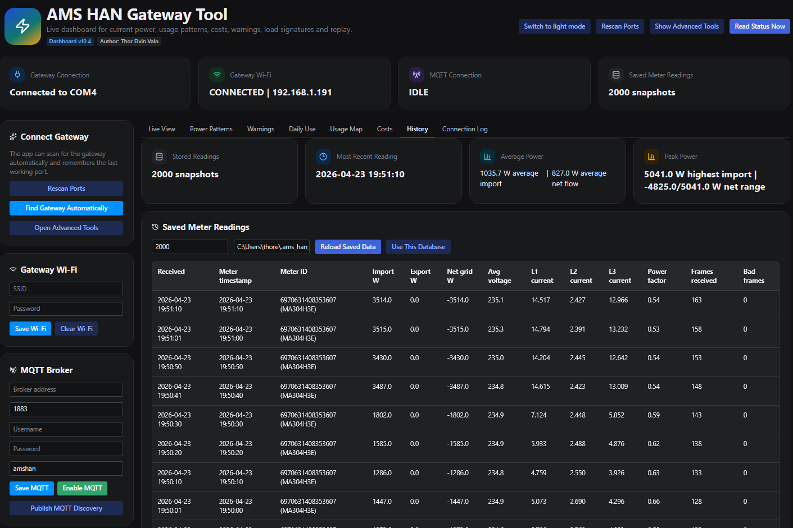

### Connection Log

Serial and application log view showing `RSP`, `FRAME`, and `SNAP` traffic from the gateway:

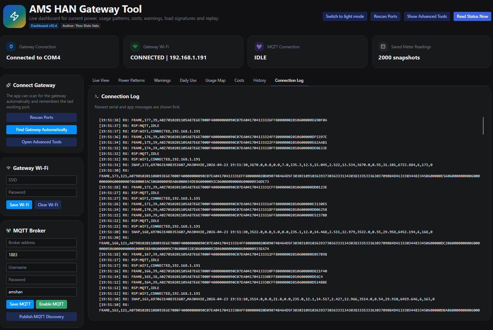

## Professional relevance

This project is directly relevant to practical metering, integration, and troubleshooting-oriented development work. It demonstrates hands-on work with:

- HAN/AMS communication
- serial communication and gateway validation
- ESP32-based embedded integration
- MQTT and smart-home oriented telemetry publishing
- phase and voltage analysis
- event detection and troubleshooting-oriented visualization
- replay-driven testing for monitoring workflows

## System overview

The project is split into two practical parts:

### ESP32 gateway

The repository includes the ESP-IDF firmware project as normal source inside `firmware/esp_idf_ams_han_gateway_wroom32d/`. Based on that source, the gateway is responsible for:

- using `UART0` as the PC command and response channel over USB
- using `UART2` for the HAN adapter on `GPIO16` and `GPIO17`
- reconstructing HDLC-style frames with `0x7E` delimiters and `0x7D` unescaping
- parsing Kaifa `KFM_001` payloads and forwarding raw `FRAME` plus derived `SNAP` data
- calculating ESP-side metrics such as net power, total current, average voltage, phase imbalance, power factor estimate, and rolling values
- storing Wi-Fi and MQTT configuration in NVS
- publishing live MQTT topics and Home Assistant discovery payloads
- accepting runtime commands such as `GET_INFO`, `GET_STATUS`, `SET_WIFI`, `SET_MQTT`, `MQTT_ENABLE`, `MQTT_DISABLE`, and `REPUBLISH_DISCOVERY`

The current firmware version defined in the source is `0.2.0-wroom32d`.

### Reflex dashboard

The local Python application is responsible for:

- automatic serial-port discovery and reconnect behavior
- parsing gateway output and enriching long-frame data
- storing snapshot history locally
- presenting live and historical views in the browser
- calculating hourly and daily energy-cost context
- detecting power, voltage, phase, and data-quality events
- building Load Signatures and hourly/weekly heatmap summaries from stored history
- supporting replay-based development and troubleshooting

The application side is now split more clearly across a focused service and state architecture:

- `service.py` acts as the thin application coordinator and compatibility facade
- `services/runtime_service.py` owns live runtime state, line handling, event logging, and dashboard sync shaping
- `services/settings_service.py` owns persisted dashboard and gateway settings
- `services/connection_service.py` owns port discovery, probing, and connection resolution
- `services/replay_service.py` owns replay loading and playback state
- `services/history_service.py` owns persisted and replay-backed snapshot history
- `services/analysis_service.py` owns diagnostics, heatmaps, and signature shaping
- `services/cost_service.py` owns hourly and daily pricing context

The UI state is also no longer carried by one giant state class alone:

- `state.py` composes the dashboard state from smaller `state_parts/` modules
- `state_parts/connection.py` covers live link status, snapshot mirroring, and top-level controls
- `state_parts/analysis.py`, `cost.py`, `diagnostics.py`, and `history.py` keep each tab's state and refresh behavior more focused
- `state_parts/derived.py` centralizes user-facing explanatory text derived from the current state

Architecture rules for those boundaries are documented in [docs/ARCHITECTURE_BOUNDARIES.md](docs/ARCHITECTURE_BOUNDARIES.md).

## Repository structure

```text
.
|-- ams_han_reflex_app/
|   |-- ams_han_reflex_app.py
|   |-- app_context.py
|   |-- service.py
|   |-- state.py
|   |-- state_parts/
|   |-- backend/
|   |-- domain/
|   |-- services/
|   `-- support/
|-- docs/
|   |-- ARCHITECTURE_BOUNDARIES.md
|   `-- images/
|-- firmware/
|   `-- esp_idf_ams_han_gateway_wroom32d/
|-- fixtures/
|-- scripts/
|-- tests/
|-- PROJECT_OVERVIEW.md
|-- README.md
|-- requirements.txt
|-- requirements-dev.txt
`-- rxconfig.py
```

- `ams_han_reflex_app/` contains the Reflex UI, state composition, service coordination, parsing, diagnostics, pricing, and replay support.
- `docs/ARCHITECTURE_BOUNDARIES.md` documents intended layer boundaries and allowed dependency direction.
- `docs/images/` contains README screenshots and hardware reference images.
- `firmware/esp_idf_ams_han_gateway_wroom32d/` contains the ESP-IDF firmware project for the ESP32 gateway in a reviewable source layout.
- `fixtures/` contains bundled replay logs for testing gateway and dashboard behavior without live data.
- `scripts/run_dashboard.py` provides a one-command local dashboard launch path.
- `scripts/run_checks.py` provides one local quality gate for linting, formatting checks, and tests.
- `tests/` contains regression coverage for replay loading, protocol parsing, heatmap analysis, service behavior, signature grouping, and a replay-driven service workflow.
- `PROJECT_OVERVIEW.md` provides a concise engineering summary of the repository.
- `requirements-dev.txt` collects the local contributor tooling used by both developers and CI.

## ESP32 firmware reference

The extracted firmware tree has a practical ESP-IDF module split:

```text
firmware/
`-- esp_idf_ams_han_gateway_wroom32d/
    |-- README.md
    |-- CMakeLists.txt
    |-- sdkconfig.defaults
    |-- main/
    |   |-- app_main.c
    |   |-- app_config.h
    |   |-- han_reader.c
    |   |-- serial_link.c
    |   |-- wifi_manager.c
    |   |-- app_mqtt.c
    |   |-- config_store.c
    |   |-- telemetry.c
    |   `-- provisioning_stub.c
    `-- tools/
        `-- pc_setup_example.py
```

The most important firmware files are:

- `main/app_main.c`: command routing, runtime config, snapshot forwarding, and periodic status publishing
- `main/han_reader.c`: UART2 HAN reading, HDLC-style frame reconstruction, Kaifa `KFM_001` parsing, and fallback ASCII test input handling
- `main/serial_link.c`: PC-facing line protocol over USB/UART0
- `main/wifi_manager.c`: Wi-Fi connect and reconnect behavior
- `main/app_mqtt.c`: MQTT publishing and Home Assistant discovery handling
- `main/config_store.c`: NVS-backed persistence for Wi-Fi and MQTT settings
- `main/telemetry.c`: cheap ESP-side derived metrics and rolling values

### Target hardware and pin layout

The embedded project is set up for an `ESP32-WROOM-32D` development board with USB.

- PC link: `UART0` over USB
- HAN adapter: `UART2`
- HAN RX: `GPIO16`
- HAN TX: `GPIO17`
- HAN UART baudrate: `2400`

### Build and flash the firmware

Use an ESP-IDF shell where `idf.py` is already available.

On Windows, the official ESP-IDF setup normally gives you an `ESP-IDF PowerShell` or `ESP-IDF Command Prompt` shortcut. If you open a normal shell instead, load the ESP-IDF environment for that installation first and then continue from the project directory below.

From `firmware/esp_idf_ams_han_gateway_wroom32d/`:

```bash
idf.py set-target esp32
idf.py build
idf.py -p COM5 flash
idf.py -p COM5 monitor
```

Practical notes:

- replace `COM5` with the actual ESP32 serial port on your machine
- run `idf.py set-target esp32` again if you switch chip family or ESP-IDF environment
- `idf.py build` is enough for CI or compile-only verification
- `idf.py flash` and `idf.py monitor` are the normal local hardware flow once the build succeeds

### Firmware serial protocol

The ESP firmware accepts one command per line over the PC serial link.

Supported commands in the current source include:

- `GET_INFO`
- `GET_STATUS`
- `SET_WIFI,<ssid>,<password>`
- `CLEAR_WIFI`
- `SET_MQTT,<host>,<port>,<user>,<password>,<topic_prefix>`
- `MQTT_ENABLE`
- `MQTT_DISABLE`
- `REPUBLISH_DISCOVERY`
- `START_PROVISIONING`
- `STOP_PROVISIONING`
- `REBOOT`
- `FACTORY_RESET`

The command format is still line-based, but it is now less brittle than before:

- Python command building escapes commas and backslashes in `SET_WIFI` and `SET_MQTT`
- the firmware command parser now unescapes those fields before validation
- this makes SSIDs, usernames, passwords, and topic prefixes safer when they contain separator-like characters

Current response and data lines include:

- `RSP:OK`
- `RSP:ERROR,<reason>`
- `RSP:INFO,<fw_ver>,<device_id>,<mac>`
- `RSP:WIFI,<state>,<ip>`
- `RSP:MQTT,<state>`
- `STATUS,WIFI,<state>,<ip>`
- `STATUS,MQTT,<state>`
- `STATUS,HAN,<state>`
- `FRAME,<seq>,<len>,<hex>`
- `SNAP,<csv fields...>`

### MQTT and Home Assistant notes

The firmware README documents a default topic prefix of `amshan/<device_id>` and publishes live state topics for status, power, phases, metrics, and raw data. It also supports retained Home Assistant MQTT discovery and can republish discovery payloads when requested with `REPUBLISH_DISCOVERY`.

### Verified Home Assistant MQTT setup

The MQTT workflow has now been verified working with a Raspberry Pi Home Assistant installation where the broker requires a username and password. The gateway was configured only from the dashboard GUI, then connected automatically and appeared in Home Assistant with working MQTT-backed entities.

Home Assistant device page after successful discovery:

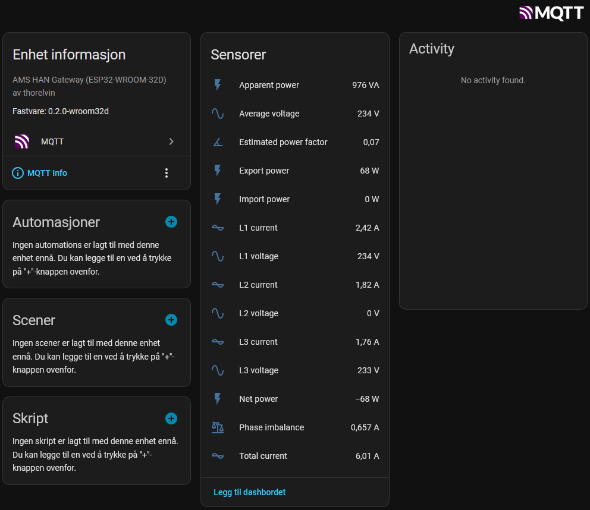

Recommended procedure:

1. In Home Assistant on the Raspberry Pi, make sure the MQTT broker is running and note the broker host or IP address, port, username, and password.
2. In the dashboard, first connect the gateway to Wi-Fi from the `Gateway Wi-Fi` panel so the ESP32 can reach the broker on the local network.
3. In the `MQTT Broker` panel, enter the broker address, port, username, password, and preferred topic prefix.
4. Click `Save MQTT` to store the broker settings in the ESP32, then click `Enable MQTT`.
5. If Home Assistant does not show the device immediately, click `Publish MQTT Discovery` once to republish the retained discovery payloads.
6. Open Home Assistant and confirm that the `AMS HAN Gateway` device appears with live power, voltage, current, and status entities.

Verified result:

- MQTT authentication with username and password worked from the dashboard GUI
- the ESP32 reconnected to MQTT automatically after the settings were stored
- Home Assistant discovered the gateway and exposed the live entities shown above

## Software requirements

- Python 3.10 or newer
- `reflex>=0.8.14,<0.9`
- `pyserial>=3.5,<4`

Python 3.10 still works with the current app, but Reflex warns that support is deprecated. Python 3.11 or newer is recommended for future-proof local development.

Install dependencies:

```bash
python -m venv .venv
.venv\Scripts\activate
pip install -r requirements.txt
```

## Developer tooling

For contributors and local quality checks, install the dev dependencies as well:

```bash
pip install -r requirements-dev.txt
```

The repository now includes one simple local check entry point:

```bash
python scripts/run_checks.py
```

That helper runs:

- `ruff` for lightweight Python linting
- `black --check` for formatting verification
- `python -m unittest` for the current regression suite

`pytest` is also included in `requirements-dev.txt` for contributors who prefer that runner or want to extend the fixture-driven test layer over time.

## CI status

The repository now includes two GitHub Actions workflows:

- `Python checks` installs the app plus contributor tooling, then runs linting, formatting checks, and the Python regression suite
- `Firmware build` compiles the ESP-IDF project on GitHub so firmware changes get a visible build result in the repository UI

## Quick start

### 1. Start the dashboard

From the repository root, run either:

```bash
reflex run
```

or:

```bash
python scripts/run_dashboard.py
```

The app will compile the Reflex frontend and start the local dashboard.

### 2. Let the app find the gateway

When the dashboard loads, it will:

- refresh available COM ports
- probe for a compatible gateway
- remember the last working port and baudrate
- request device information and status once connected

If you are working without live hardware, open the advanced tools and use a replay file instead.

### 3. Use the dashboard

The default experience is built around a few main areas:

- `Live View`: current import/export view, energy rollups, snapshot details, and gateway status
- `Power Patterns`: phase focus, imbalance, voltage behavior, busiest hours, and repeating-load summaries
- `Warnings`: issue summary, health panel, and filtered event tracker
- `Daily Use`: daily hourly buckets and a graph-oriented overview of the latest meter day
- `Usage Map`: recent-day and weekday-pattern heatmaps with thresholded `L1/L2/L3` and `3P` switch counts, or conductor pairs in `IT` mode
- `Costs`: spot-price context, grid-rate settings, hourly cost rows, and capacity estimate
- `History`: stored snapshot table, averages, peaks, and local database summary
- `Connection Log`: serial and application log output from the gateway workflow

### 4. Optional firmware workflow

If you want to work on the embedded side as well as the dashboard:

- open the ESP-IDF project inside `firmware/esp_idf_ams_han_gateway_wroom32d/`
- use an ESP-IDF shell and run `idf.py set-target esp32`, `idf.py build`, `idf.py -p COM5 flash`, and `idf.py -p COM5 monitor`
- connect the ESP32 over USB so the Reflex app can probe it as the gateway source

## Replay workflow

Replay mode is useful for offline development, repeatable debugging, and demonstrating specific electrical scenarios.

Open `Show Advanced Tools` and then use the `Replay or Demo Data` panel to:

- load a replay file from a full local path
- load the bundled demo replay
- upload a `.log` or `.txt` replay file through the browser
- start, pause, resume, or stop playback

Replay mode feeds the same analysis, diagnostics, daily, cost, and history views as live gateway traffic, which makes it practical for regression checking and event-engine tuning.

## Bundled replay scenarios

The repository includes ready-made replay logs in [fixtures/README.md](fixtures/README.md):

- `demo_session.log`: baseline demo session
- `replay_phase_loss_l2.log`: L2 voltage disappears briefly and then recovers
- `replay_load_switching.log`: single-phase and three-phase load changes
- `replay_voltage_sag.log`: import surge with visible phase sag and spread
- `replay_solar_export_cycle.log`: import shifts into export and then returns

These files are designed to exercise the current event engine and cost/history pipeline using realistic `FRAME` plus `SNAP` sequences.

## Diagnostics and analysis focus

This project is especially oriented toward practical interpretation of meter data, not just raw display.

Current analysis and diagnostics include:

- missing-voltage quality detection when a phase drops below valid range
- suppression of misleading spread alerts when a voltage channel is invalid
- voltage-sag and phase-spread detection
- baseline-driven load-session start and end events
- power-step detection against recent samples
- recurring load-signature grouping with phase tagging, event counts, representative watt size, and confidence
- signature duty-cycle summaries including average runtime, starts per day, common start hour, and weekday-versus-weekend frequency
- time-weighted hourly heatmaps for recent-day and weekday-pattern analysis
- thresholded phase-switch counts for `L1`, `L2`, `L3`, and `3-phase` activity inside each heatmap hour, or `L1-L2`, `L1-L3`, `L2-L3`, and `3-phase` in `IT` mode
- user-selectable `TN` and `IT` mains interpretation so event and switch attribution fits the installation type
- explicit warnings in the UI when live spot pricing is unavailable and cost calculations fall back to an estimate
- likely device hints for large single-phase and three-phase changes
- cost rows built from elapsed time between snapshots rather than raw sample counts
- capacity estimate based on top hourly import averages on different days

## Pricing and tariff defaults

The spot-price workflow already warns clearly when the live source is unavailable, but some tariff assumptions are still shipped as practical defaults:

- the day and night grid-energy rates start from example values and can be changed from the `Costs` tab
- the monthly capacity-step ladder is currently a built-in reference table for estimation, not a full tariff engine for every Norwegian grid company
- those defaults are intentionally easy to find in `ams_han_reflex_app/domain/pricing.py` if you want the repository to reflect another utility model

That means the cost and capacity views are useful for comparison, planning, and peak hunting, but users should still align the defaults with their own tariff rules before treating the result as billing-like truth.

## Testing

Automated coverage is still lighter than full live-hardware end-to-end testing, but it now protects several of the highest-value seams in the repository:

```bash
python -m unittest
```

or, with the local helper:

```bash
python scripts/run_checks.py
```

This currently checks:

- replay lines can be loaded into a usable playback session
- protocol parsing accepts expected gateway line formats
- command encoding escapes commas and backslashes correctly for `SET_WIFI` and `SET_MQTT`
- serial auto-connect does not reconnect an already-open link
- runtime-state handling keeps live parsing, replay playback, and dashboard sync behavior aligned
- signature grouping produces representative watt values
- heatmap analysis produces stable hourly and weekday outputs
- a replay-driven service workflow can build stored history, heatmaps, and cost summaries from realistic gateway lines
- price quotes fall back immediately while background refresh is in flight, then use cached day data once available

## Related repositories

- [AMS_HAN_Sniffer](https://github.com/thorelvin/AMS_HAN_Sniffer)  
  Arduino-oriented HAN/AMS work related to the broader project family.

- [AMS_HAN_Sniffer_PC](https://github.com/thorelvin/AMS_HAN_Sniffer_PC)  
  PC-focused monitoring and analysis project with a similar practical documentation standard.

## Important note

This is a personal engineering and learning project.

It is not a certified measuring instrument and should not be used as the sole basis for:

- electrical safety decisions
- official metering purposes
- billing disputes
- formal fault diagnosis

Suspected electrical faults or installation concerns should always be reviewed by a qualified electrician.

## Current status

The repository currently provides:

- a working Reflex dashboard for live and replayed gateway data
- bundled scenario logs for diagnostics and replay development
- integrated pricing, capacity, diagnostics, history, and heatmap views
- thresholded phase-switch heatmaps, Load Signatures, and duty-cycle summaries for pattern-oriented analysis
- user-selectable `TN` and `IT` mains interpretation across events, signatures, and heatmaps
- theme switching, advanced tools, and improved hourly-cost rendering
- lighter refresh behavior so heavier tabs do not churn in the background unnecessarily
- explicit service boundaries for connection, replay, history, analysis, and cost handling
- explicit architecture-boundary documentation and a simpler one-command local launch path

The project is active and structured for continued iteration around replay coverage, gateway integration, and deeper analysis features.

## Future improvements

Possible next steps include:

- broader replay fixture coverage for more edge cases
- expanded gateway protocol and status visibility
- richer export and solar-specific analysis
- click-through from heatmap cells into matching History or Diagnostics windows
- additional historical summaries and trend views
- stronger automated tests around parsing, diagnostics, and pricing
- easier packaging for non-development use

## Author

**Thor Elvin Valo**

## License

This project is licensed under the **MIT License**.

See [LICENSE](LICENSE) for the full license text.
