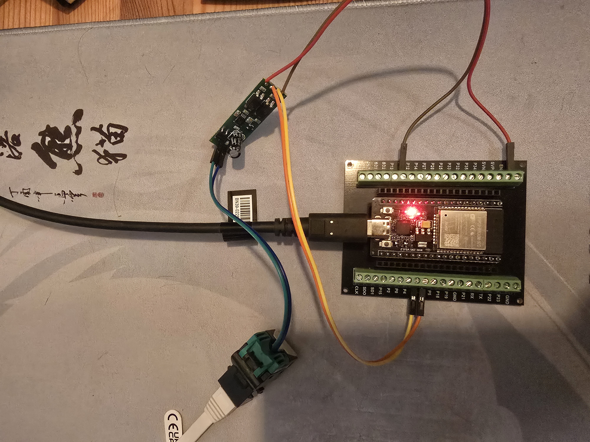
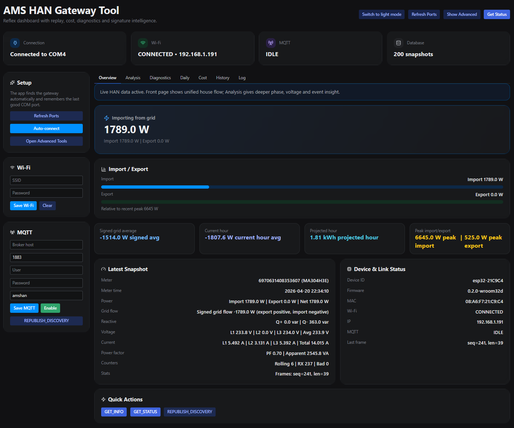
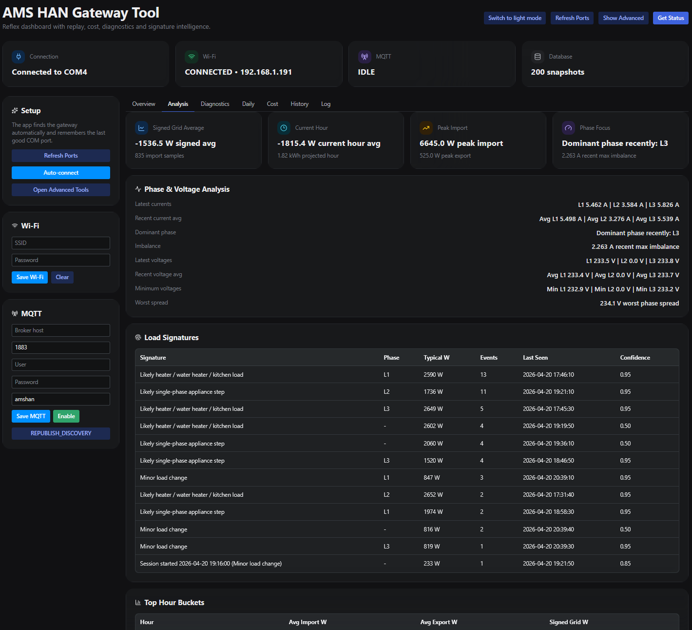
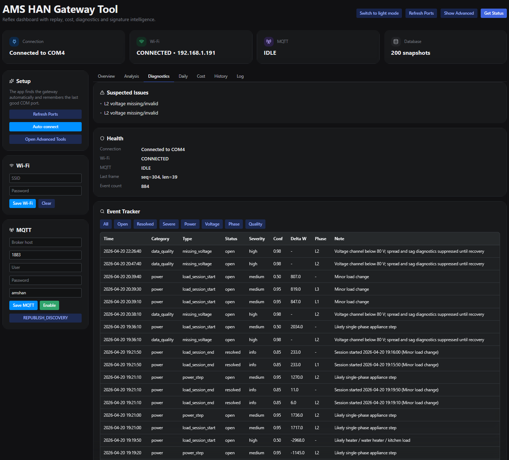
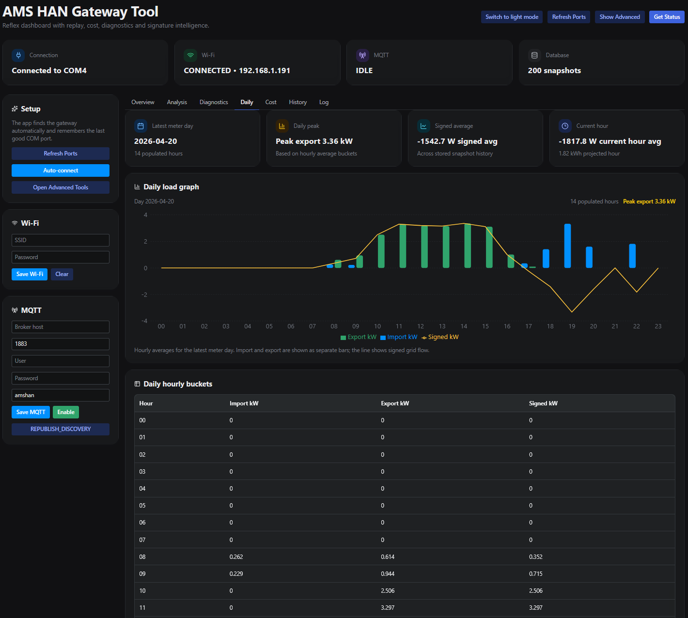
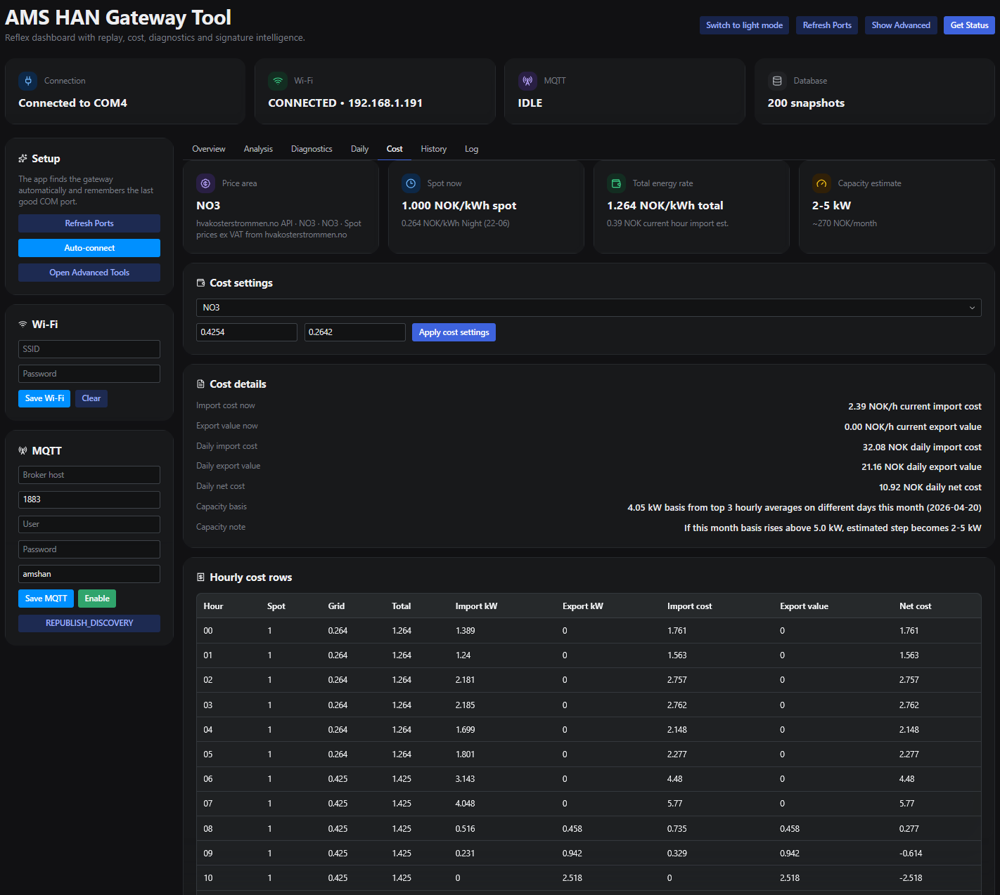
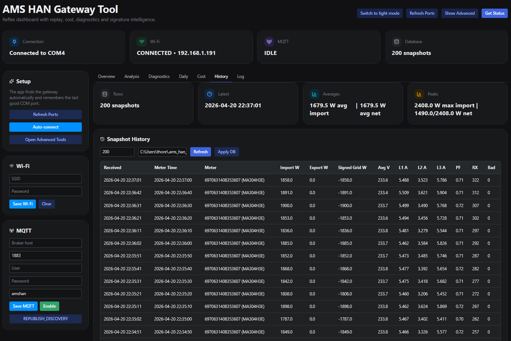
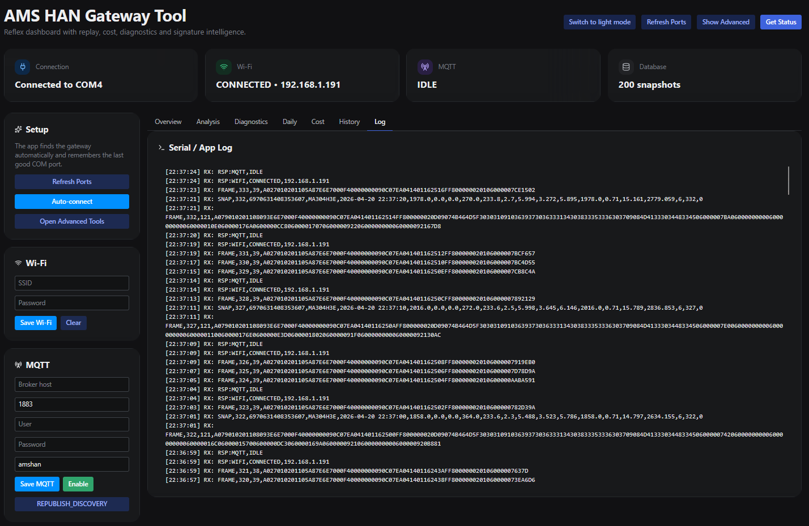
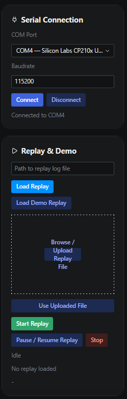

# AMS HAN Gateway

A practical AMS/HAN smart-meter monitoring project built around an ESP32 gateway and a local Reflex dashboard.

This repository focuses on the gateway-side monitoring experience: live meter visibility, replay-driven troubleshooting, diagnostics, phase and voltage analysis, and Norwegian power-cost context in one local web application. The goal is to keep the embedded gateway workflow lightweight while letting the dashboard handle parsing, storage, visualization, event detection, and operator-facing analysis.

It is intended as a practical engineering project for understanding household import and export behavior, identifying costly load peaks, tracking power-quality hints, and testing HAN workflows without depending on live hardware for every iteration.

## Key features

- ESP-IDF firmware scaffold for ESP32-WROOM-32D with UART2 HAN capture, NVS-backed config, MQTT publishing, and Home Assistant discovery republish
- Auto-detects the gateway over serial and remembers the last working COM port
- Live overview of import, export, signed grid flow, current hour, and projected hour
- Device and link status for gateway identity, firmware, Wi-Fi, MQTT, and last frame activity
- Diagnostics for missing voltage channels, voltage sag, phase spread, power steps, and load sessions
- Phase and voltage analysis with imbalance, dominant-phase, and worst-spread summaries
- Local snapshot history with daily buckets, top-hour tracking, and event-signature summaries
- Cost analysis with Norwegian price areas `NO1` to `NO5`, configurable grid rates, and capacity estimation
- Replay and demo workflow for offline development, debugging, and scenario validation
- Upload support for replay logs directly from the dashboard
- Gateway control actions for `GET_INFO`, `GET_STATUS`, Wi-Fi setup, MQTT setup, and discovery republish

## Verified hardware setup

The hardware setup used in this repository has been verified in practice with the ESP32 gateway, HAN adapter, and the local Reflex dashboard workflow shown below.

### Hardware reference

ESP32 gateway, terminal shield, USB link, and HAN adapter wiring used in the current setup:



Example setup:

- Smart meter with HAN port enabled
- HAN / M-Bus interface adapter
- ESP32-WROOM-32D dev board with USB connection
- USB connection from ESP32 to PC
- Windows PC running the Reflex dashboard

## Wiring diagram summary

The hardware is connected as follows:

- **Smart meter HAN port**
  Use the HAN / RJ45 output from the meter.
  In this setup, the HAN / M-Bus pair is taken from **pin 1** and **pin 2**.
  Polarity does **not** matter for the HAN pair itself.

- **HAN / M-Bus to TTL adapter**
  Connect the two HAN wires from the smart meter to the adapter input.
  The adapter acts as the electrical interface between the meter HAN signal and the ESP32 UART side.

- **Adapter to ESP32**
  The firmware uses **UART2** on the ESP32 for HAN communication.
  **ESP32 GPIO16** is configured as **HAN RX**.
  **ESP32 GPIO17** is configured as **HAN TX**.
  Use a shared **GND** between the adapter and the ESP32.
  The exact adapter power pin depends on the adapter board variant, so verify the board markings and voltage requirement before connecting VCC.

- **ESP32 to PC**
  Connect the ESP32 to the PC over USB.
  The USB link provides the PC-side serial channel on **UART0**, which the dashboard uses for `GET_INFO`, `GET_STATUS`, `FRAME`, and `SNAP` traffic.

This matches the current firmware configuration in the repository, where the HAN UART is set to `2400` baud on `UART2`.

## Dashboard screenshots

The screenshots below show the current interface and the main operator views available in the dashboard.

### Overview tab

Live import/export overview, latest snapshot, quick actions, and gateway status:



### Analysis tab

Phase and voltage analysis together with load signatures and top-hour buckets:



### Diagnostics tab

Suspected issues, health panel, and filtered event tracker for power, voltage, phase, and data-quality events:



### Daily tab

Daily load graph and hourly buckets for the latest meter day:



### Cost tab

Price area, grid settings, hourly cost rows, and capacity estimate:



### History tab

Stored snapshot history with averages, peaks, and local database context:



### Log tab

Serial and application log view showing `RSP`, `FRAME`, and `SNAP` traffic from the gateway:



### Advanced tools

Serial connection controls plus replay and demo workflow:



## Professional relevance

This project is directly relevant to practical metering, integration, and troubleshooting-oriented development work. It demonstrates hands-on work with:

- HAN/AMS communication
- serial communication and gateway validation
- ESP32-based embedded integration
- MQTT and smart-home oriented telemetry publishing
- phase and voltage analysis
- event detection and troubleshooting-oriented visualization
- replay-driven testing for monitoring workflows

## System overview

The project is split into two practical parts:

### ESP32 gateway

The repository includes an ESP-IDF firmware project inside `esp32_wroom32d_ams_han_gateway.zip`. Based on that source, the gateway is responsible for:

- using `UART0` as the PC command and response channel over USB
- using `UART2` for the HAN adapter on `GPIO16` and `GPIO17`
- reconstructing HDLC-style frames with `0x7E` delimiters and `0x7D` unescaping
- parsing Kaifa `KFM_001` payloads and forwarding raw `FRAME` plus derived `SNAP` data
- calculating ESP-side metrics such as net power, total current, average voltage, phase imbalance, power factor estimate, and rolling values
- storing Wi-Fi and MQTT configuration in NVS
- publishing live MQTT topics and Home Assistant discovery payloads
- accepting runtime commands such as `GET_INFO`, `GET_STATUS`, `SET_WIFI`, `SET_MQTT`, `MQTT_ENABLE`, `MQTT_DISABLE`, and `REPUBLISH_DISCOVERY`

The current firmware version defined in the source is `0.2.0-wroom32d`.

### Reflex dashboard

The local Python application is responsible for:

- automatic serial-port discovery and reconnect behavior
- parsing gateway output and enriching long-frame data
- storing snapshot history locally
- presenting live and historical views in the browser
- calculating hourly and daily energy-cost context
- detecting power, voltage, phase, and data-quality events
- supporting replay-based development and troubleshooting

## Repository structure

```text
.
|-- ams_han_reflex_app/
|   |-- ams_han_reflex_app.py
|   |-- service.py
|   |-- state.py
|   |-- backend/
|   |-- domain/
|   `-- support/
|-- docs/
|   `-- images/
|-- fixtures/
|-- tests/
|-- esp32_wroom32d_ams_han_gateway.zip
|-- PROJECT_OVERVIEW.md
|-- README.md
|-- requirements.txt
`-- rxconfig.py
```

- `ams_han_reflex_app/` contains the Reflex UI, application service, parsing, diagnostics, pricing, and replay support.
- `docs/images/` contains README screenshots and hardware reference images.
- `esp32_wroom32d_ams_han_gateway.zip` contains the bundled ESP-IDF firmware project for the ESP32 gateway.
- `fixtures/` contains bundled replay logs for testing gateway and dashboard behavior without live data.
- `tests/` currently contains replay-player validation.
- `PROJECT_OVERVIEW.md` provides a concise engineering summary of the repository.

## ESP32 firmware reference

The bundled zip contains an ESP-IDF project with a practical module split:

```text
esp32_wroom32d_ams_han_gateway.zip
`-- esp_idf_ams_han_gateway_wroom32d/
    |-- README.md
    |-- CMakeLists.txt
    |-- sdkconfig.defaults
    |-- main/
    |   |-- app_main.c
    |   |-- app_config.h
    |   |-- han_reader.c
    |   |-- serial_link.c
    |   |-- wifi_manager.c
    |   |-- app_mqtt.c
    |   |-- config_store.c
    |   |-- telemetry.c
    |   `-- provisioning_stub.c
    `-- tools/
        `-- pc_setup_example.py
```

The most important firmware files are:

- `main/app_main.c`: command routing, runtime config, snapshot forwarding, and periodic status publishing
- `main/han_reader.c`: UART2 HAN reading, HDLC-style frame reconstruction, Kaifa `KFM_001` parsing, and fallback ASCII test input handling
- `main/serial_link.c`: PC-facing line protocol over USB/UART0
- `main/wifi_manager.c`: Wi-Fi connect and reconnect behavior
- `main/app_mqtt.c`: MQTT publishing and Home Assistant discovery handling
- `main/config_store.c`: NVS-backed persistence for Wi-Fi and MQTT settings
- `main/telemetry.c`: cheap ESP-side derived metrics and rolling values

### Target hardware and pin layout

The embedded project is set up for an `ESP32-WROOM-32D` development board with USB.

- PC link: `UART0` over USB
- HAN adapter: `UART2`
- HAN RX: `GPIO16`
- HAN TX: `GPIO17`
- HAN UART baudrate: `2400`

### Building the firmware

After extracting `esp32_wroom32d_ams_han_gateway.zip`, the bundled ESP-IDF README uses the following workflow:

```bash
idf.py set-target esp32
idf.py build
idf.py -p COM5 flash monitor
```

### Firmware serial protocol

The ESP firmware accepts one command per line over the PC serial link.

Supported commands in the current source include:

- `GET_INFO`
- `GET_STATUS`
- `SET_WIFI,<ssid>,<password>`
- `CLEAR_WIFI`
- `SET_MQTT,<host>,<port>,<user>,<password>,<topic_prefix>`
- `MQTT_ENABLE`
- `MQTT_DISABLE`
- `REPUBLISH_DISCOVERY`
- `START_PROVISIONING`
- `STOP_PROVISIONING`
- `REBOOT`
- `FACTORY_RESET`

Current response and data lines include:

- `RSP:OK`
- `RSP:ERROR,<reason>`
- `RSP:INFO,<fw_ver>,<device_id>,<mac>`
- `RSP:WIFI,<state>,<ip>`
- `RSP:MQTT,<state>`
- `STATUS,WIFI,<state>,<ip>`
- `STATUS,MQTT,<state>`
- `STATUS,HAN,<state>`
- `FRAME,<seq>,<len>,<hex>`
- `SNAP,<csv fields...>`

### MQTT and Home Assistant notes

The firmware README documents a default topic prefix of `amshan/<device_id>` and publishes live state topics for status, power, phases, metrics, and raw data. It also supports retained Home Assistant MQTT discovery and can republish discovery payloads when requested with `REPUBLISH_DISCOVERY`.

## Software requirements

- Python 3.10 or newer
- `reflex>=0.8.14,<0.9`
- `pyserial>=3.5,<4`

Python 3.10 still works with the current app, but Reflex warns that support is deprecated. Python 3.11 or newer is recommended for future-proof local development.

Install dependencies:

```bash
python -m venv .venv
.venv\Scripts\activate
pip install -r requirements.txt
```

## Quick start

### 1. Start the dashboard

From the repository root, run:

```bash
reflex run
```

The app will compile the Reflex frontend and start the local dashboard.

### 2. Let the app find the gateway

When the dashboard loads, it will:

- refresh available COM ports
- probe for a compatible gateway
- remember the last working port and baudrate
- request device information and status once connected

If you are working without live hardware, open the advanced tools and use a replay file instead.

### 3. Use the dashboard

The default experience is built around a few main areas:

- `Live`: current import/export view, snapshot details, and gateway status
- `Analysis`: phase focus, imbalance, voltage behavior, top hourly buckets, and signature summaries
- `Diagnostics`: issue summary, health panel, and filtered event tracker
- `Daily`: daily hourly buckets and a graph-oriented overview of the latest meter day
- `Cost`: spot-price context, grid-rate settings, hourly cost rows, and capacity estimate
- `History`: stored snapshot table, averages, peaks, and local database summary

### 4. Optional firmware workflow

If you want to work on the embedded side as well as the dashboard:

- extract `esp32_wroom32d_ams_han_gateway.zip`
- open the ESP-IDF project inside `esp_idf_ams_han_gateway_wroom32d/`
- build and flash the ESP32 firmware
- connect the ESP32 over USB so the Reflex app can probe it as the gateway source

## Replay workflow

Replay mode is useful for offline development, repeatable debugging, and demonstrating specific electrical scenarios.

Open `Show Advanced` and then use the `Replay & Demo` panel to:

- load a replay file from a full local path
- load the bundled demo replay
- upload a `.log` or `.txt` replay file through the browser
- start, pause, resume, or stop playback

Replay mode feeds the same analysis, diagnostics, daily, cost, and history views as live gateway traffic, which makes it practical for regression checking and event-engine tuning.

## Bundled replay scenarios

The repository includes ready-made replay logs in [fixtures/README.md](C:\Users\thore\Documents\Codex\2026-04-20-files-mentioned-by-the-user-ams\AMS-HAN-Gateway\fixtures\README.md):

- `demo_session.log`: baseline demo session
- `replay_phase_loss_l2.log`: L2 voltage disappears briefly and then recovers
- `replay_load_switching.log`: single-phase and three-phase load changes
- `replay_voltage_sag.log`: import surge with visible phase sag and spread
- `replay_solar_export_cycle.log`: import shifts into export and then returns

These files are designed to exercise the current event engine and cost/history pipeline using realistic `FRAME` plus `SNAP` sequences.

## Diagnostics and analysis focus

This project is especially oriented toward practical interpretation of meter data, not just raw display.

Current analysis and diagnostics include:

- missing-voltage quality detection when a phase drops below valid range
- suppression of misleading spread alerts when a voltage channel is invalid
- voltage-sag and phase-spread detection
- baseline-driven load-session start and end events
- power-step detection against recent samples
- likely device hints for large single-phase and three-phase changes
- cost rows built from elapsed time between snapshots rather than raw sample counts
- capacity estimate based on top hourly import averages on different days

## Testing

Current automated coverage is lightweight and focused on replay support:

```bash
python -m unittest tests/test_replay_player.py
```

This verifies that replay lines can be loaded and normalized into a usable playback session.

## Related repositories

- [AMS_HAN_Sniffer](https://github.com/thorelvin/AMS_HAN_Sniffer)  
  Arduino-oriented HAN/AMS work related to the broader project family.

- [AMS_HAN_Sniffer_PC](https://github.com/thorelvin/AMS_HAN_Sniffer_PC)  
  PC-focused monitoring and analysis project with a similar practical documentation standard.

## Important note

This is a personal engineering and learning project.

It is not a certified measuring instrument and should not be used as the sole basis for:

- electrical safety decisions
- official metering purposes
- billing disputes
- formal fault diagnosis

Suspected electrical faults or installation concerns should always be reviewed by a qualified electrician.

## Current status

The repository currently provides:

- a working Reflex dashboard for live and replayed gateway data
- bundled scenario logs for diagnostics and replay development
- integrated pricing, capacity, diagnostics, and history views
- theme switching, advanced tools, and improved hourly-cost rendering

The project is active and structured for continued iteration around replay coverage, gateway integration, and deeper analysis features.

## Future improvements

Possible next steps include:

- broader replay fixture coverage for more edge cases
- expanded gateway protocol and status visibility
- richer export and solar-specific analysis
- additional historical summaries and trend views
- stronger automated tests around parsing, diagnostics, and pricing
- easier packaging for non-development use

## Author

**Thor Elvin Valo**
